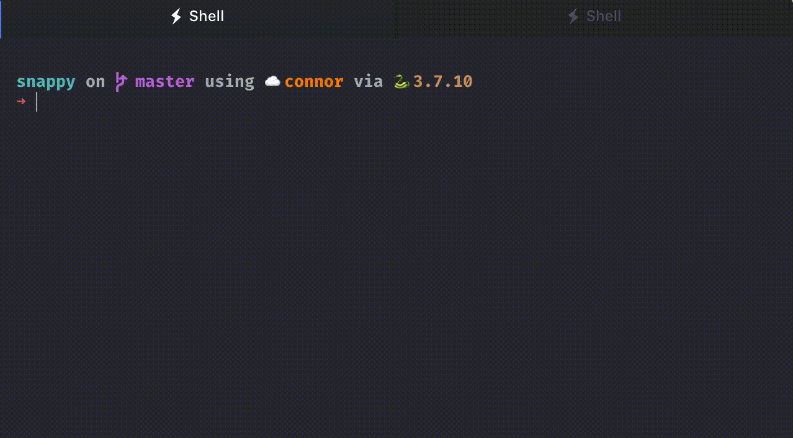

<div align="center">
  <h1>Snappy</h1>
<p> <strong>S</strong>erverless <strong>N</strong>o-frills <strong>A</strong>pplication <strong>P</strong>roduction with <strong>Py</strong>thon</p>
<p align="center">

<a href="https://github.com/connor-mccarthy/snappy/workflows/build/badge.svg">
    
</a>
<a href="https://img.shields.io/github/v/release/connor-mccarthy/snappy">
    
</a>
</a>
<a href="https://img.shields.io/badge/python-3.7.10-blue.svg">
    
</a>
<a href="https://img.shields.io/badge/code%20style-black-000000.svg">
    
</a>

<p>A small, opinionated CLI and decorator for lightning-fast deployment of Python apps / microservices on AWS Lambda.</p>
</div>



Snappy uses a CLI and a single decorator function to enable rapid development and deployment of containerized Python applications to AWS Lambda. Snappy works by prescribing a simple application file structure, standardizing naming conventions where names are only temporary, and abstracting away several of Lambda's most idiosyncratic details, which can be time-consuming to figure out and debug.

Snappy also improves the developer experience by:
* Reducing boilerplate code
* Enabling easy implementation of client-agnostic event handlers

Snappy does _not_ enable infinitely configurable deployments out of the box. For applications with complex dependencies or environment setups, interacting with the Docker and Lambda APIs directly will absolutely be preferred.

I built this to serve my own need to tighten up my iterative development loop when creating Lambda-based microservices.

## Installation
Using pip:

```sh
pip install git+https://github.com/connor-mccarthy/snappy.git
```
## The handler decorator
Other than the CLI, this library features only a single decorator function that will designate any arbitrary Python functions that take [JSON Data Type](https://www.w3schools.com/js/js_json_datatypes.asp) as the Lambda event handler:

```python
# app.py
from snappy import set_handler

@set_handler
def greeting(name: str, age: int): -> str:
    return f"Hello! My name is {name}. I am {age} years old."
```

This wrapper works by manipulating the local namespace so that Lambda can identify your function as the entrypoint to the container. It also features minimal event processing to make event requests client agnostic, which does not occur by default with Lambda. (Sometimes events are strings, sometimes they are dictionaries, depending on the client making the request.)

## Commands
[check](#check)  
[configure](#init)  
[build](#build)  
[run](#run)  
[running](#running)  
[stop](#stop)  
[invoke](#invoke)  
[push](#push)  
[attach](#attach)  
[deploy](#deploy)
### Global options
* `-h` (`--help`):            Display documentation
* `-q` (`--quiet`):           Do not output any message
* `-v` (`--verbose`):         Increase the verbosity of messages: "`-v`" for normal output, "`-vv`" for
                        more verbose output and "`-vvv`" for debug
* `-V` (`--version`):         Display this application version
* `--ansi`:                 Force ANSI output
* `--no-ansi`:              Disable ANSI output
* `-n` (`--no-interaction`):  Do not ask any interactive question
### `check`

The `check` command validates the structure of your project. This evaluation happens relative to the working directory where the command is run.

The structure requirements are:
* One `app.py` file beneath working directory
* One `requirements.txt` file in the same directory as your app.py file
* One `snappy.yaml` file in the same directory as your app.py file.

If there is no `snappy.yaml` file in your project, you will be prompted to create one with the `init` command.
```sh
snappy check
```
### `init`
The `init` command helps you create a `snappy.yaml` file in the same directory as your `app.py` file. It will interactively ask you to fill in the three fields snappy needs to configure your Lambda:
* lambda_function_name
* arn_name
* repository_name

If two `app.py` files are found beneath the working directory where this is run, it will throw an error.
```sh
snappy init
```
### `build`
The `build` command is a simple wrapper around Docker's build command, with a few Lambda-specific configurations. `build` will build your Lambda container, naming it according to the ECR repository specified the `snappy.yaml` file and tagging it as `latest`.
```sh
snappy build
```
### `run`
The `run` command is a simple wrapper around Docker's run command, with a few Lambda-specific configurations and logic consistent with the `build` command. `run` will run your Lambda container locally.

### `running`
The `running` command will list all running containers that are children of the Python 3.7 Lambda base image (`public.ecr.aws/lambda/python:3.7`). This is helpful for easy debugging and inspecting what ports are in use.
```sh
snappy running
```
### `stop`
The `stop` command will stop all running containers that are children of the Python 3.7 Lambda base image (`public.ecr.aws/lambda/python:3.7`). These are the same containers that are listed by the `running` command.

```sh
snappy stop
```
### `invoke`
The `invoke` command is used to test your Lambda function, both when running locally and in production.

`invoke` defaults to invoking your production Lambda function, specified by the name in your `snappy.yaml` function:

```sh
snappy invoke
```

The `invoke` command takes an optional JSON payload, with keys mapping to event handler parameter names and values to the corresponding parameter values:

```sh
snappy invoke '{"name": "World"}'
```

An invocation without a payload defaults to an invocation with an empty payload:

```sh
snappy invoke '{}'
```

You can also invoke your function when it's running locally (initiated using the `run` command), with or without a payload:

```sh
snappy invoke --local '{"arg1": 10}'
```

To minimize the verbosity of the reponse payload and only see the body of the response, pass the `--body-only` option:
```sh
snappy invoke --body-only
```
#### Arguments
* `payload`: The first argument is an optional payload that accepts JSON. For example, a hello_word function might accept a name argument, passed in as '`{"name": "World"}`'.

#### Options
* `--local` (`-l`): If set, the command will invoke the locally running Lambda container.
* `--body-only` (`-b`): If set, the command will only display the body of the response.

### `push`
The `push` command will push your image to the ECR repository specified in the `snappy.yaml` file.

If the specified repository does not exist, you will be able to create it through the CLI.

```sh
snappy push
```
### `attach`
The `attach` command attaches your pushed image to the function specified in the `snappy.yaml` file.

If the specified function does not exist, you will be able to create it through the CLI, after which the most recent image in your ECR repository will be attached.

```sh
snappy attach
```
### `deploy`
The `deploy` command is a meta command that runs `build`, `push`, and `attach` sequentially.

The most simple possible workflow to deploy a Lambda function, barring any bugs, would be to run the `check`, `init`, and `deploy` commands sequentially:

```sh
snappy check && snappy configure && snappy deploy
```

## Disclaimer
This works on my machine with my AWS configuration (`~/.aws/credentials` and `~/.aws/config` files). Your mileage may vary. There are undoubtedly still outstanding bugs and bug reports are encouraged!
